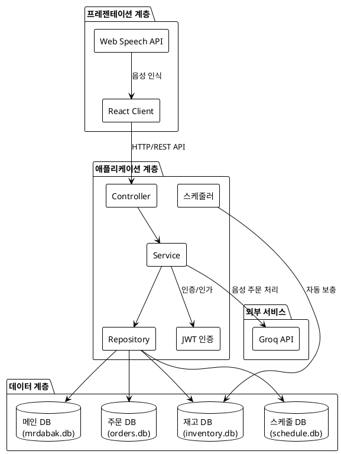

# 아키텍처 다이어그램

## PlantUML 형식

## 아키텍처 설명

### 프레젠테이션 계층
- **React Client**: 사용자 인터페이스 제공
- **Web Speech API**: 브라우저 기반 음성 인식

### 애플리케이션 계층
- **Controller**: REST API 엔드포인트
- **Service**: 비즈니스 로직
- **Repository**: 데이터 접근
- **JWT 인증**: 사용자 인증/인가
- **스케줄러**: 재고 자동 보충 작업

### 데이터 계층
- **메인 DB**: 사용자, 메뉴 정보
- **재고 DB**: 재고 관리
- **주문 DB**: 주문 정보
- **스케줄 DB**: 배달 스케줄

### 외부 서비스
- **Groq API**: 음성 주문 AI 처리

