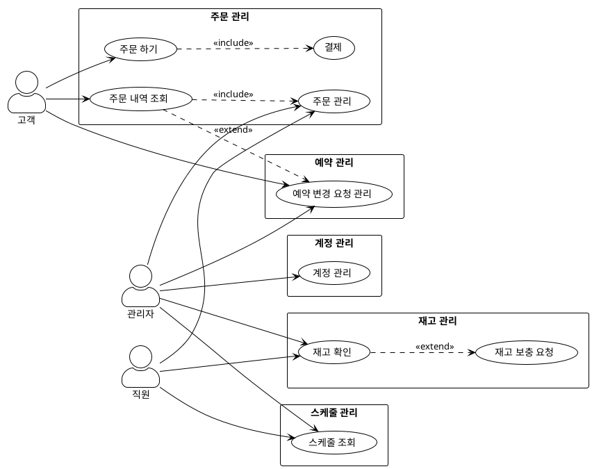

# 유즈케이스 다이어그램

## PlantUML 형식

## 유즈케이스 설명

### 기능별 그룹화

**주문 관리**
- 주문 하기 (고객)
- 주문 내역 조회 (고객)
- 주문 관리 (직원, 관리자)
- 결제 (주문 하기에 포함)

**예약 관리**
- 예약 변경 요청 관리 (고객, 관리자)

**재고 관리**
- 재고 확인 (직원, 관리자)
- 재고 보충 요청 (재고 확인에서 확장)

**스케줄 관리**
- 스케줄 조회 (직원, 관리자)

**계정 관리**
- 계정 관리 (관리자)

### 관계 설명

**Include 관계 (필수)**
- 주문 하기 → 결제: 주문 시 결제는 필수
- 주문 내역 조회 → 주문 관리: 내역 조회 시 관리 기능 포함

**Extend 관계 (선택적)**
- 재고 확인 → 재고 보충 요청: 재고 확인 중 필요 시 보충 요청 가능
- 주문 내역 조회 → 예약 변경 요청 관리: 내역 조회 중 변경 요청 가능

